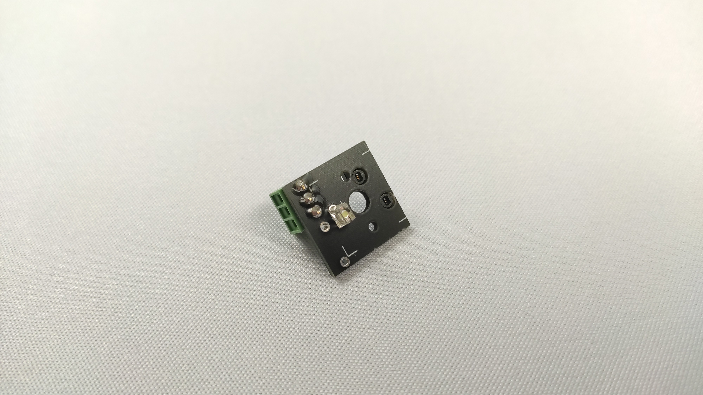
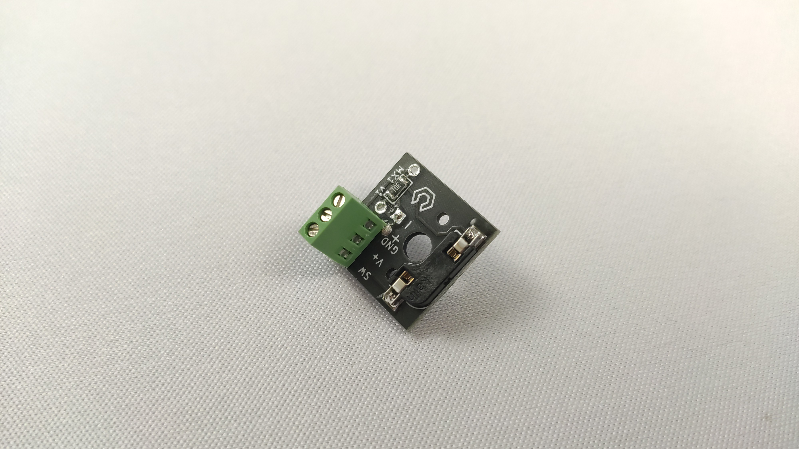
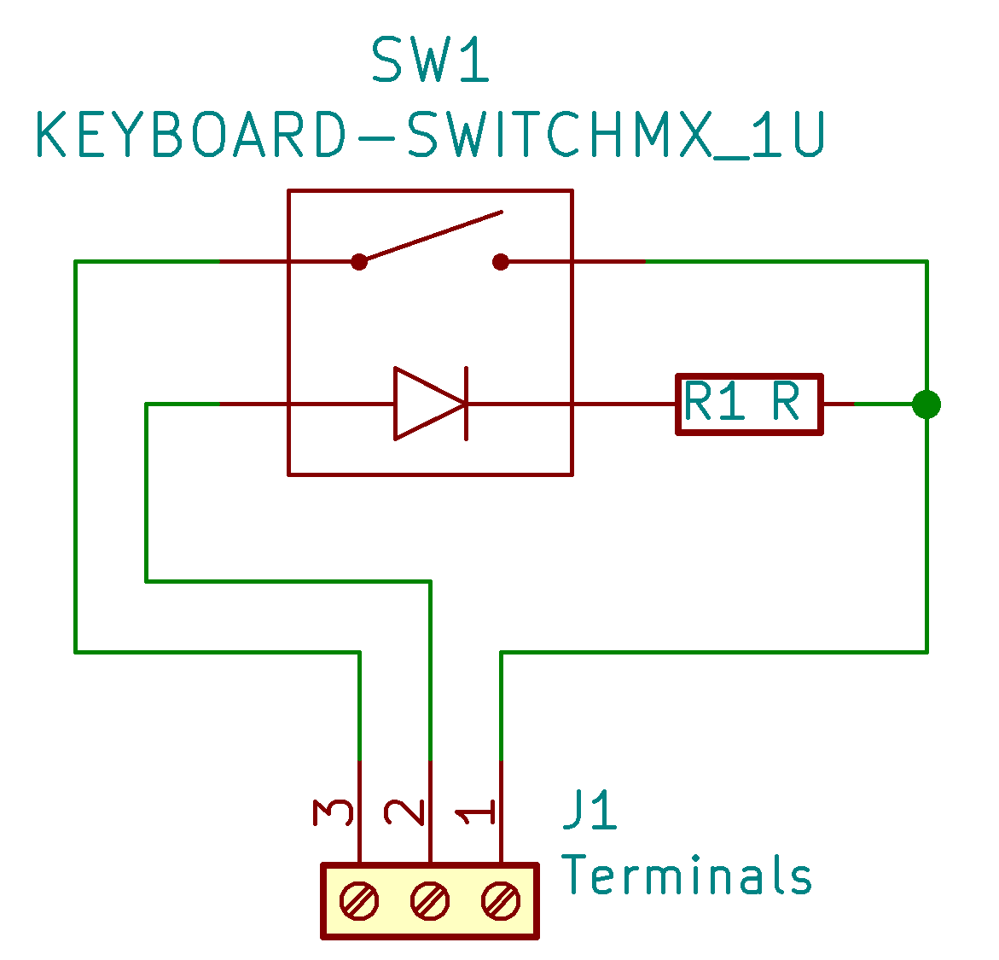

# Model MX1
A single switch PCB with a Kailh hotswap socket, a 2 pin THT LED mount, a mount for both THT and SMT (0805) resistors, and a mount for a 3 position 2.54mm pitch screw terminal.

## License
This project is licenced under the GNU GPL Version 3. [See the included LICENSE file for details](LICENSE).

## Support my work
I set up a donation link for people who appreciate my work and wish to donate. Donations are greatly appreciated, but are far from necessary:

https://www.paypal.com/donate/?hosted_button_id=NFDEML5FKR8N8